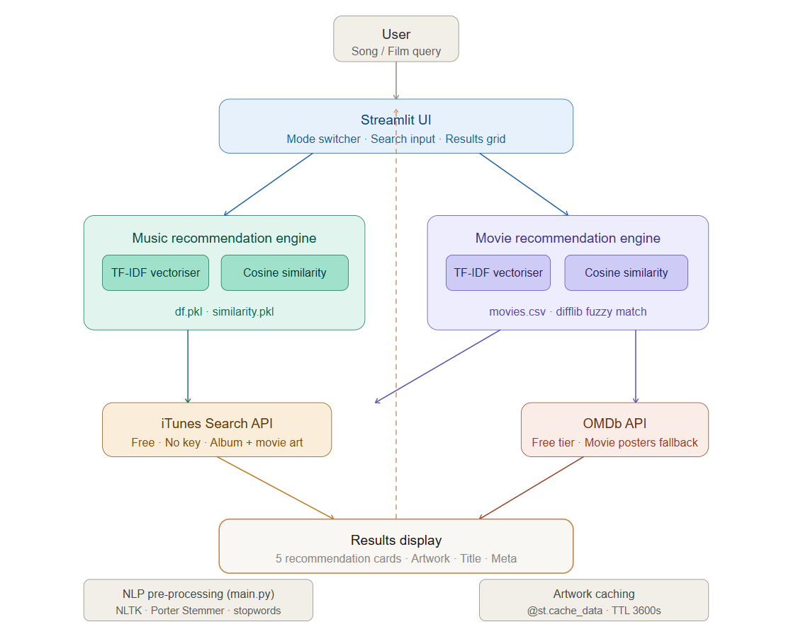
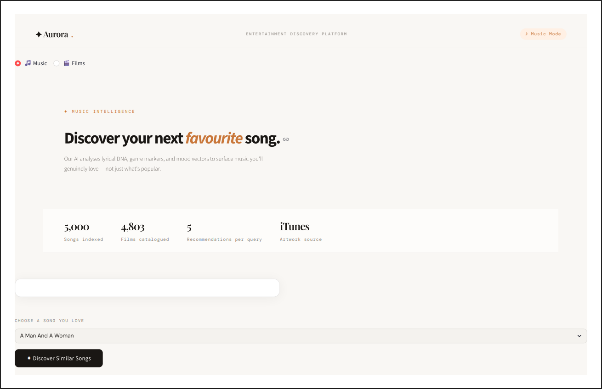
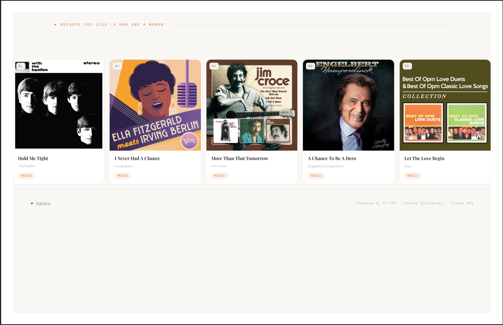
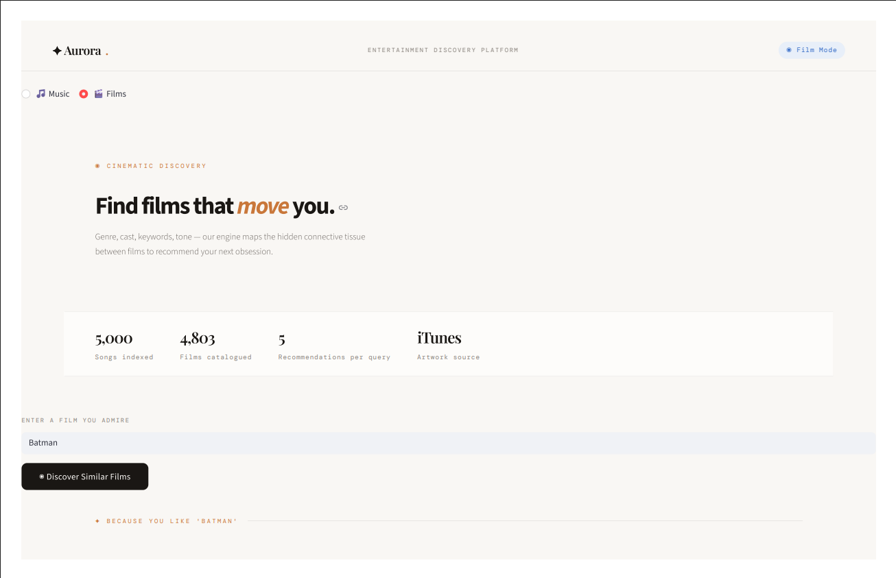
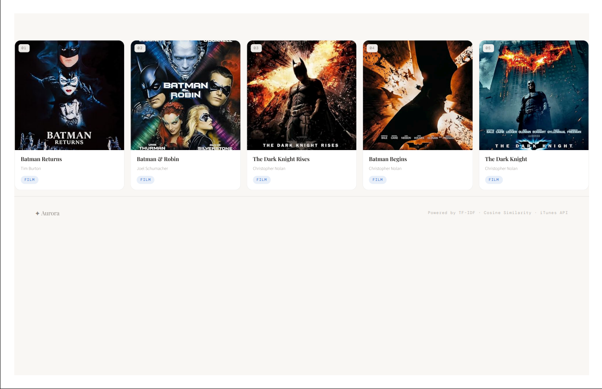

# ✦ Aurora-AI-Entertainment-Discovery-Platform
### Entertainment Discovery Platform

*AI-powered Music & Movie Recommendations Engine built with Streamlit, TF-IDF, Cosine Similarity; iTunes/OMDb APIs — designed, production-grade.*

---

## ✦ What is Aurora?

**Aurora** is a unified, AI-powered entertainment discovery platform that recommends **music** and **movies** tailored to your taste — all wrapped in a world-class, light-themed UI built entirely with Streamlit.

> No Spotify Premium. No paywalls. Just pure intelligence.

---

## ✦ Features

| Feature | Detail |
|---|---|
| Music Recommendations | Lyric-based similarity via TF-IDF + Porter Stemmer |
| Movie Recommendations | Multi-feature similarity (genre, cast, keywords, director) |
| Live Artwork | iTunes API + OMDb API — high-res posters, no auth hassle |
| Fast | `@st.cache_data` caching — artwork fetched once, reused |
| Premium UI | Playfair Display + DM Sans, warm editorial light theme |
| Unified App | One interface, two engines, zero conflicts |

---

## ✦ Tech Stack

Frontend     →  Streamlit + Custom CSS (Playfair Display, DM Sans)
ML Engine    →  scikit-learn (TF-IDF Vectorizer + Cosine Similarity)
NLP          →  NLTK (Porter Stemmer, Tokenization)
Music API    →  iTunes Search API (free, no key needed)
Movie API    →  OMDb API (free tier, 1000 req/day)
Language     →  Python 3.10+

---

## ✦ How It Works

### Music
1. Lyrics are lowercased, cleaned, and stemmed using Porter Stemmer
2. TF-IDF vectorises the processed text (10,000 features)
3. Cosine similarity ranks all 5,000 songs against your pick
4. Top 5 matches are returned with iTunes artwork

### Movies
1. Genre + keywords + tagline + cast + director are combined
2. TF-IDF vectorises the combined feature string
3. Cosine similarity finds the closest cinematic matches
4. `difflib` handles typos in your search query
5. Posters fetched from iTunes → OMDb fallback chain

---
## ✦ Live Demo

# Music Recommendations 

# Movie Recommendations

# Refer Demo PDF (assets folder)
[View Full Demo PDF](./assets/Aurora_Movie_Music_Recommendation_Demo_1.pdf)
[View Full Demo PDF](./assets/Aurora_Movie_Music_Recommendation_Demo_2.pdf)

